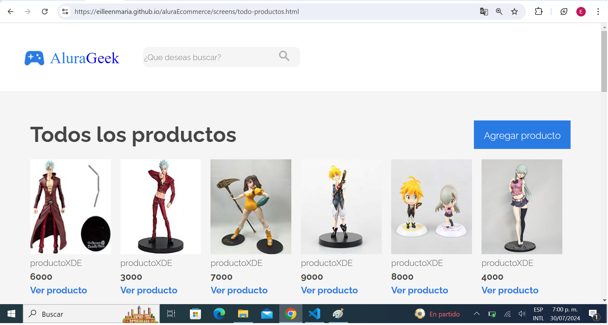
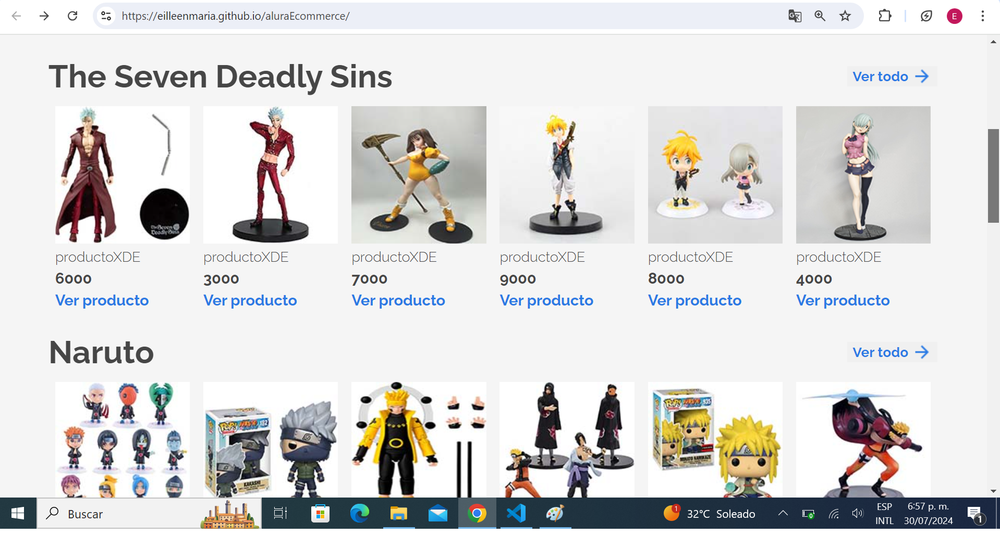
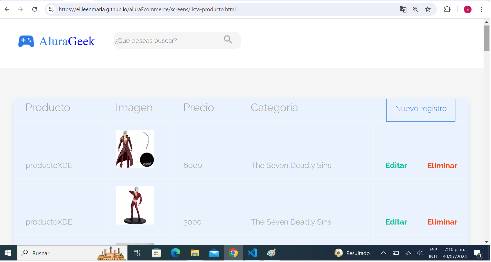
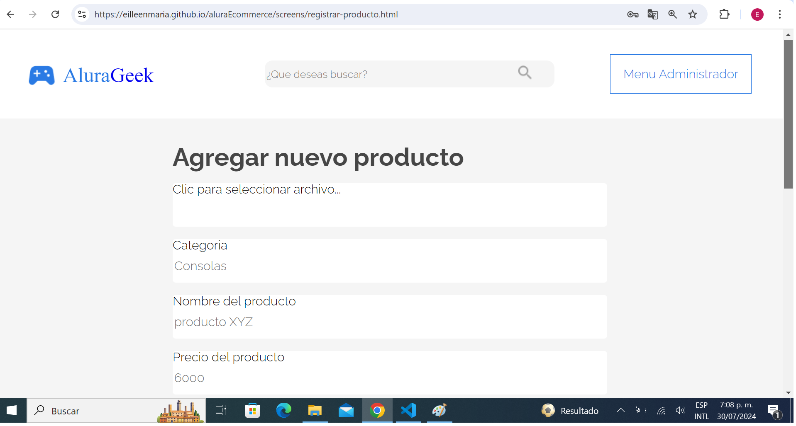

# aluraEcommerce
### Proyect in HTML, CSS and JS with JSON SERVER and NODE.JS
### NODE initializacion : npm start
### Start Apiweb  for render  products data <a href="https://apiweb-y4tv.onrender.com/producto" target="_blank">Go Api products<a/> and data users <a href="https://apiweb-y4tv.onrender.com/users" target="_blank">Go Api users<a/> 
### Sesion = email: melanyn-pena@mail.com  password: Mp123456
 
<a href="https://eilleenmaria.github.io/aluraEcommerce/index.html" target="_blank">GO TO PAGE</a>
 
 

## View all products

## View products for category

## View list product

## View add new product

